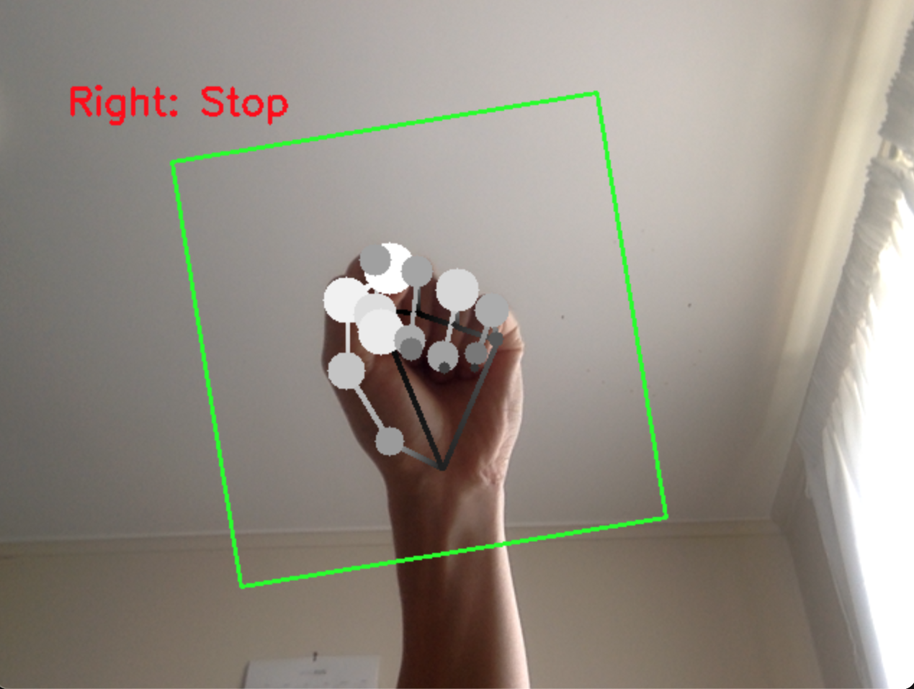
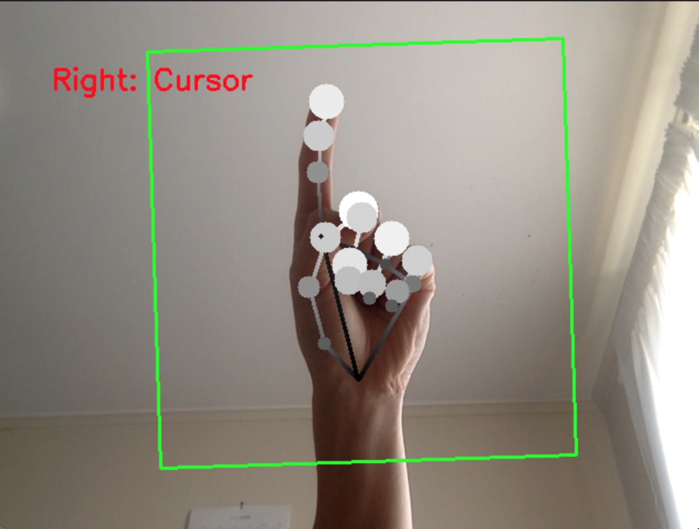

## Gesture-Controlled Desktop Cursor


This is a prototype system for controlling the desktop mouse cursor via hand gestures. It's built using Google's [MediaPipe](https://developers.google.com/mediapipe) library for real-time, on-device hand recognition, combined with a custom-trained feed-foward neural net for identifying gestures.

Currently, only two main gestures are supported:

<table>
    <tr>
        <td></td>
        <td></td>
    </tr>
</table>

### Running hand tracking demo (MacOS)

Build command:

```
bazel build -c opt --verbose_failures --experimental_repo_remote_exec --define MEDIAPIPE_DISABLE_GPU=1 \
    src:run_graph_main
```

Notes:

- `MEDIAPIPE_DISABLE_GPU=1` must be set during build as MediaPipe only supports GPU inference for Linux at the moment.
- The `--experimental_repo_remote_exec` flag needs to be passed to properly build the project based on external dependencies such as MediaPipe & Tensorflow without relying on local copies/installations to be in place.

Run command:

```
GLOG_logtostderr=1 bazel-bin/src/run_graph_main --resource_root_dir=bazel-bin/src/run_graph_main.runfiles/mediapipe
```

Notes:

- By default, the `PalmDetectionModelLoader` calculator that gets called by the parent `HandLandmarkTrackingCpu` graph will attempt to load the model at `mediapipe/modules/palm_detection/palm_detection_full.tflite`.
  - This will fail in cases where mediapipe is not directly installed within the project directory, and so the `--resource_root_dir` flag must be used to prepend a root directory prefix to the default model path.
  - In this case, the models are made available within the `bazel-bin/path/to/bin.runfiles` via the `data` dependencies for `run_graph_main.cc` defined in `src/BUILD`.

### To-dos

- [ ] Migrate bazel external dependencies to use bazel modules and switch to bazel 7.X
- [ ] Improve classifier model stability by collecting a larger dataset or transfer learning from another pre-trained model
- [ ] Update classsifer model training code to save & load from checkpoints to avoid full re-training every time
- [ ] Train additional gestures to support a larger variety of cursor actions (left/right/double click, scroll, back/forward navigation)
  - [ ] Implement corresponding cursor manipulation logic for supported gestures
- [ ] Convert gesture classifer to take single-hand landmark inputs & run inference on each hand to produce batched gestures
- [ ] Add debounce to changes in recognised gestures to avoid abrupt transitions due to transitory movement
- [ ] Add smoothing of landmark_xy delta calculations to remove cursor jitter during static gestures
- [ ] Look into supporting zoom via two-handed gestures
- [ ] Add support for windows/linux platforms
